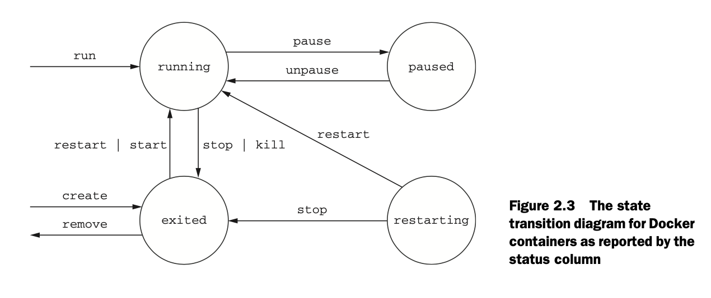

Dockers use Linux namespaces and cgroups, which have been part of Linux since 2007. Docker does not provide the container technology but it makes it simpler to use.
The docker containers are isolated with respect to eight aspects.

- PID namespace - process identifiers and capabilities
- UTS namespace - Host and domain name
- MNT namespace - File system access and structure
- IPC namespace - process communication over shared memory
- NET namespace 0 Network access and structure
- USR namespace - User names and identifiers
- chroot() - controls the location of the file system root
- cgroups - Resource protection

Linux namespaces and cgroups take care of containers at runtime. docker uses another set of technologies to provide containers for files that act like shipping containers

### Creating and starting a new container:

```shell
docker run --detach --name web nginx:latest 
```
When this command is run, Docker will install `nginx:latest` deom the Nginx erpositroy hosted on Docker Hub. This outputs a blob of characters in the terminal. This looks something like this: `ghnjfcghjnfchgjfaghjdf9823972hgabjabagjs`

This is the unique identifier of the container that was just created to run nginx. Everytime `docker run` is used, the created container will have a similar unique identifier.

The `--detach` flag makes docker run in the background, it can also be given as `-d`

#### Running interactive containers:

Programs that interact with users tend to feel more interactive.

```
docker run --interactive -t \ 
--link web:web \
--name web_test \
busybox:latest /bin/sh
```
this uses two flags, `--interactive` (or `-i`) and `--tty` (or `-t`).

The `--interactive` flag tells Docker to keep the the *standard Input stream* open. 

The `-t` flag tells docker to *allocate a virtual terminal for the container*, Which will  allow you ot pass the signals to the container.

The command in teh interactive container exampel creates a container, starts a UNIX shell, and is linked to the container that's running NGINX. From this shell we can verify that the web server is running correctly by 

`
wget -O - http://web:80/
`

This terminal can be shut down by typing  `exit`. **This will terminate the shell program and stop the container.**

It's possible to create an interactive container, manyally start a process insisde that container and then detach you terminal. You can do so by holding Ctrl (or Control) key and pressing P and then Q. This will work only when you've used the --tty option.

This is a monitoring agent that will test the web server as we did previously and send a message with the mailer if the web server stops. this command will start the agent in a interactive container using the short-form flags:

```shell
docker run -it \
--name agent \
--link web:insideweb \
--link mailer:insidemailer \
dockerinaction/ch2_agent
```

The `-it` is because single character flags can be combined [check here](https://docs.docker.com/engine/reference/commandline/cli/#:~:text=Single%20character%20command%20line%20options%20can%20be%20combined%2C%20so%20rather%20than%20typing%20docker%20run%20%2Di%20%2Dt%20%2D%2Dname%20test%20busybox%20sh)

### Listing, stopping, restarting, and viewing output of containers

```
docker ps
```
This will list the detailes about the running containers

## PID namespces and conflict resolution

The below command can be used to rename old containers. This helps in resolving name conflicts between containers
```
docker rename <oldname> <newname>

docker run -d --name webid nginx
```

When a container is run in detached mode, A random hash is printed on the terminal as an identifier. This identifier can be used to identify specific container


```
docker exec kjsddi234jkjh3h42b3423h4b23n4k234j23k4k234 ps

docker stop uakjsdnfjadskj1jk23jbb31b2j2b3hj1bj23bbj2b 
```



```
MAILER_CID=$(docker run -d dockerinaction/ch2_mailer)
WEB_CID=$(docker create nginx)

AGENT_CID=$(docker create --link $WEB_CID:insideweb \
--link $MAILER_CID:insidemailer \
dockerinaction/ch2_agent)
```

This can be used as a script to create the mailing program.

__Containers should be started in reverse order of their dependency.__ Like a DAG.

## Building environment-agnostic systems

Software needs to be system agnostic to be runnable anywhere.

There are three specific features to help build environemnt-agnostic systems:

- Read-only file system
- Environment variable injection
- volumes

For example if we are running a wordpress container. Wordpress requires a mysql db. So a wordpress has a read-only file system


### Read-only file systems.

Read-only file systems ar ebeneficial in two ways.

- Tere is confidence that the container won't be specialized from changes to the files it contains.
- An attacker can't compromise files in the container.


#### *Example: Wordpress containers*

```
docker run -d --name wp --read-only wordpress:4
```

the status of a running container can be found like so,

```
docker inspect --format "{{.State.Running}}" wp
```

`docker inspect` prints the json document that docker maintains for that container `--format` flag can be used to fetch a specific key. We are trying to get the value of Running from the state object.

The above command should output an error saying WORDPRESS_DB_HOST is not present

This happens because WordPress has a dependency on a mySQL db.
This can be installed with the following command

```
docker run -d --name wpdb \
-e MYSQL_ROOT_PASSWORD=ch2demo \
mysql:5
```

Once this is started, we can create a new wordpress container that is linked to this new DB container

```
docker run -d --name wp2 \
--link wpdb:mysql \
-p 80 --read-only \
wordpress:4
```

the `--link` flag is used to link one container with another

When inspected, this throws another error saying unable to write lockfile. This happens because the wordpress appllication tries to write a file at a specific location and this is not possible right now.

An exception to the read-only file system in this case. Using a **Docker volume**

Starting container with specific volumes for read only exceptions
```
docker run -d --name wp3 --link wpdb:mysql -p 80 \
-v /run/lock/apache2/ \
-v /run/apache2/ \
--read-only wordpress:4
```

This creates specific voluems for writeable space

### Environment Variable injectiopin

```
docker run \
--env MY_ENVIRONMENT_VAR="this is a test" \
busybox:latest \
env
```


The `--env` flag-or `-e` for short--can be used to inject any environment variable. If the variable is already set by the image or Docker, then the value will be overridden.


### Automatically restarting containers

Docker provides this functionality with a restart policy. This can b edone using the `--restart` flag at container-creatioin time, you can tell Docker to do any of the following:

- Never restart (default)
- Attempt to restart when a failure is detected
- Attempt for some predetermined time to restart when a failure is detected
- Akways restart the container regardless of the condition

Docker uses __Exponential Backoff__ strategy for timing restart attempts.

```
docker run -d --name backoff-detector --restart always busybox date
```

## Keeping containers running with supervisor and startup processes

A supervisor process, or init process, is a program that's used to launch and maintain the state of other programs. On a Linux system, PID#1 is an init process. It starts all the other system processes and restarts them in the event that they fail unexpectedly. It's common practice to use a similar pattern inside contaiiners to start and manage proesses.

Using a supervisor process insisd eyour container will __keep the container running in the event that the target process, a web server, for exampel, fails and is restarted. There are several programs that might be used insisde a container. The most popular include `init, systemd, runit, upstart,` and `supervisord`.

Running the below command starts an example container with `supervisord`
```
docker run -d -p 80:80 --name lamp-test tutum/lamp
```

__The processes running in a container can be inspected using `docker top` command.__

```
docker top lamp-test
```

The supervisord restart functionality can be tested by stopping one of the process manually. To properly stop a process we need to know the PID in the container's PID namespace. to get that list, run the following exec subcommand:

```
docker exec lamp-test ps
```

This outputs the PID for that specific container.
The Apache service can be canceled by running,

```
docker exec lamp-test kill <PID>
```

This will kill the `apache` process and make it shut down. Then, supervisord promptly restarts the processes. This can be clearly seen in the logs of the container.

```
docker logs lamp-test
```
A common alternative to the use of init or supervisor programs is using a startup script that at least checks the preconditions for successfully starting the contained software. these are sometimes used as the default command for the container. For example the WordPress containers that was previously created, use
and `entrypoint.sh` 


### Cleaning up

The `docker ps -a` command outputs all containers that are dead or alive.

As you can see it can get pretty messy quick. To remove a specific container `docker rm` can be used.

If we try to remove a container that is running, restarting or paused. Then we get an error message.

All containers use hard drive space to store __*logs, container metadata, and files that have beenn written to the container file system*__ All containers also consume resources in the global namespace like container names and host port mappings.

The processes running in a container should be stopped before te files in the container are removed. You can do this with the `docker stop` command or by  using the `-f` flag on docker rm. Thekey difference is that when you stop a process using the `-f` flag. Docker sends a `SIG_KILL` signal, whcih immediately terminates the receiving process. In contrast, using `docker stop` will send a SIG_HUP signal. Recepients of `SIG_HUP` have time to perform finalization and cleanup tasks. the `SIG_KILL` signal makes for no such allowances and can result in file corruption or poor network experiences. You can issue a `SIG_KILL` directly to a container using the `docker kill` command as well.


When experimenting with short-lived containers, This can be avoided by using the `--rm` on the command. Doing so will automatically removes the container as soon as it enters the exited state, For example, the following command will write a message to the screen in a new BusyBox container, and the container will be removed as soon as it exits.

# Software Installation simplified

Chapter 1 and 2 introduce the all-new concepts and abstractions provided by Docker.

