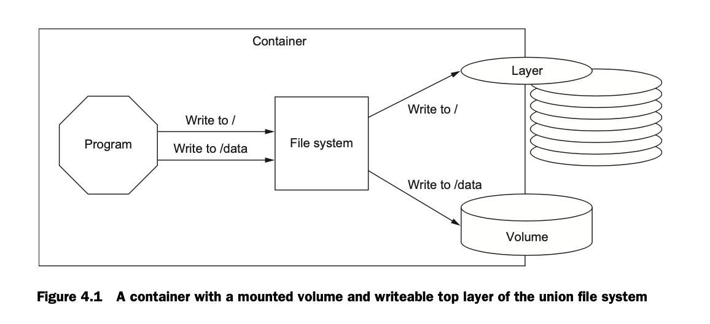
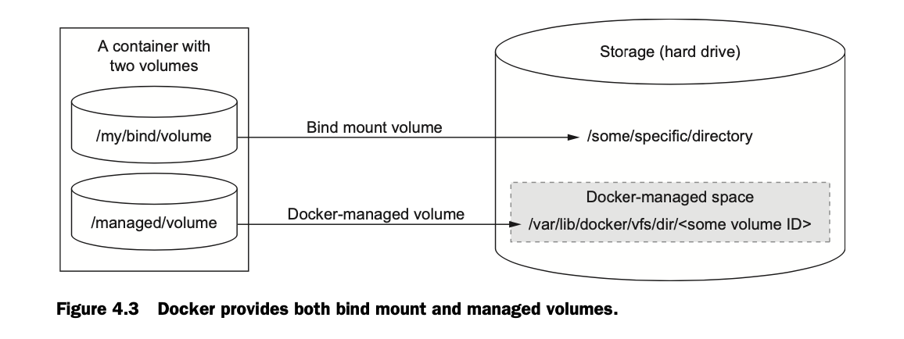
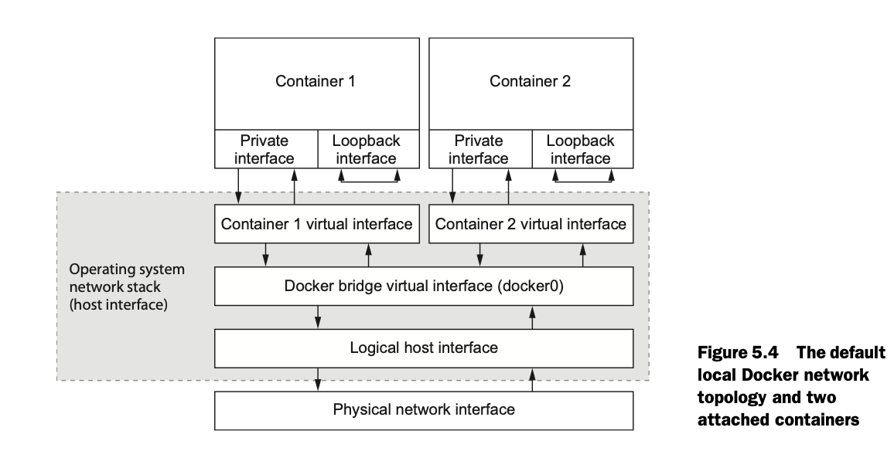
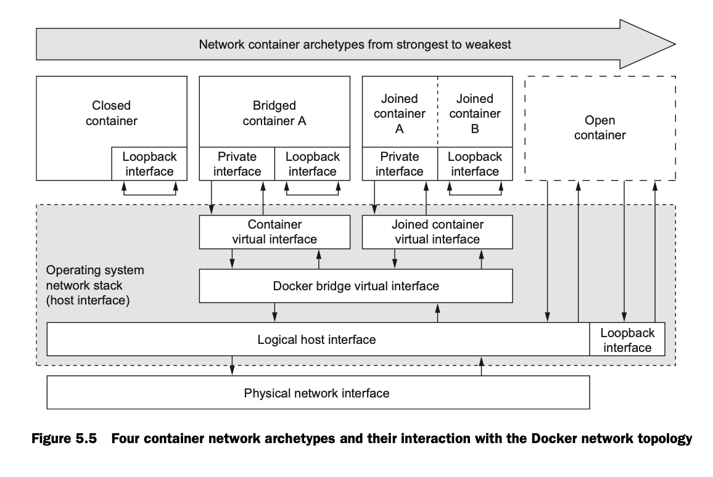

Personal notes from `Docker in action` book


Dockers use Linux namespaces and cgroups, which have been part of Linux since 2007. Docker does not provide the container technology but it makes it simpler to use.
The docker containers are isolated with respect to eight aspects.

- PID namespace - process identifiers and capabilities
- UTS namespace - Host and domain name
- MNT namespace - File system access and structure
- IPC namespace - process communication over shared memory
- NET namespace 0 Network access and structure
- USR namespace - User names and identifiers
- chroot() - controls the location of the file system root
- cgroups - Resource protection

Linux namespaces and cgroups take care of containers at runtime. docker uses another set of technologies to provide containers for files that act like shipping containers

### Creating and starting a new container:

```shell
docker run --detach --name web nginx:latest 
```
When this command is run, Docker will install `nginx:latest` deom the Nginx erpositroy hosted on Docker Hub. This outputs a blob of characters in the terminal. This looks something like this: `ghnjfcghjnfchgjfaghjdf9823972hgabjabagjs`

This is the unique identifier of the container that was just created to run nginx. Everytime `docker run` is used, the created container will have a similar unique identifier.

The `--detach` flag makes docker run in the background, it can also be given as `-d`

#### Running interactive containers:

Programs that interact with users tend to feel more interactive.

```
docker run --interactive -t \ 
--link web:web \
--name web_test \
busybox:latest /bin/sh
```
this uses two flags, `--interactive` (or `-i`) and `--tty` (or `-t`).

The `--interactive` flag tells Docker to keep the the *standard Input stream* open. 

The `-t` flag tells docker to *allocate a virtual terminal for the container*, Which will  allow you ot pass the signals to the container.

The command in teh interactive container exampel creates a container, starts a UNIX shell, and is linked to the container that's running NGINX. From this shell we can verify that the web server is running correctly by 

`
wget -O - http://web:80/
`

This terminal can be shut down by typing  `exit`. **This will terminate the shell program and stop the container.**

It's possible to create an interactive container, manyally start a process insisde that container and then detach you terminal. You can do so by holding Ctrl (or Control) key and pressing P and then Q. This will work only when you've used the --tty option.

This is a monitoring agent that will test the web server as we did previously and send a message with the mailer if the web server stops. this command will start the agent in a interactive container using the short-form flags:

```shell
docker run -it \
--name agent \
--link web:insideweb \
--link mailer:insidemailer \
dockerinaction/ch2_agent
```

The `-it` is because single character flags can be combined [check here](https://docs.docker.com/engine/reference/commandline/cli/#:~:text=Single%20character%20command%20line%20options%20can%20be%20combined%2C%20so%20rather%20than%20typing%20docker%20run%20%2Di%20%2Dt%20%2D%2Dname%20test%20busybox%20sh)

### Listing, stopping, restarting, and viewing output of containers

```
docker ps
```
This will list the detailes about the running containers

## PID namespces and conflict resolution

The below command can be used to rename old containers. This helps in resolving name conflicts between containers
```
docker rename <oldname> <newname>

docker run -d --name webid nginx
```

When a container is run in detached mode, A random hash is printed on the terminal as an identifier. This identifier can be used to identify specific container


```
docker exec kjsddi234jkjh3h42b3423h4b23n4k234j23k4k234 ps

docker stop uakjsdnfjadskj1jk23jbb31b2j2b3hj1bj23bbj2b 
```


```
MAILER_CID=$(docker run -d dockerinaction/ch2_mailer)
WEB_CID=$(docker create nginx)

AGENT_CID=$(docker create --link $WEB_CID:insideweb \
--link $MAILER_CID:insidemailer \
dockerinaction/ch2_agent)
```

This can be used as a script to create the mailing program.

__Containers should be started in reverse order of their dependency.__ Like a DAG.

## Building environment-agnostic systems

Software needs to be system agnostic to be runnable anywhere.

There are three specific features to help build environemnt-agnostic systems:

- Read-only file system
- Environment variable injection
- volumes

For example if we are running a wordpress container. Wordpress requires a mysql db. So a wordpress has a read-only file system


### Read-only file systems.

Read-only file systems ar ebeneficial in two ways.

- Tere is confidence that the container won't be specialized from changes to the files it contains.
- An attacker can't compromise files in the container.


#### *Example: Wordpress containers*

```
docker run -d --name wp --read-only wordpress:4
```

the status of a running container can be found like so,

```
docker inspect --format "{ {.State.Running} }" wp
```

`docker inspect` prints the json document that docker maintains for that container `--format` flag can be used to fetch a specific key. We are trying to get the value of Running from the state object.

The above command should output an error saying WORDPRESS_DB_HOST is not present

This happens because WordPress has a dependency on a mySQL db.
This can be installed with the following command

```
docker run -d --name wpdb \
-e MYSQL_ROOT_PASSWORD=ch2demo \
mysql:5
```

Once this is started, we can create a new wordpress container that is linked to this new DB container

```
docker run -d --name wp2 \
--link wpdb:mysql \
-p 80 --read-only \
wordpress:4
```

the `--link` flag is used to link one container with another

When inspected, this throws another error saying unable to write lockfile. This happens because the wordpress appllication tries to write a file at a specific location and this is not possible right now.

An exception to the read-only file system in this case. Using a **Docker volume**

Starting container with specific volumes for read only exceptions
```
docker run -d --name wp3 --link wpdb:mysql -p 80 \
-v /run/lock/apache2/ \
-v /run/apache2/ \
--read-only wordpress:4
```

This creates specific voluems for writeable space

### Environment Variable injectiopin

```
docker run \
--env MY_ENVIRONMENT_VAR="this is a test" \
busybox:latest \
env
```


The `--env` flag-or `-e` for short--can be used to inject any environment variable. If the variable is already set by the image or Docker, then the value will be overridden.


### Automatically restarting containers

Docker provides this functionality with a restart policy. This can b edone using the `--restart` flag at container-creatioin time, you can tell Docker to do any of the following:

- Never restart (default)
- Attempt to restart when a failure is detected
- Attempt for some predetermined time to restart when a failure is detected
- Akways restart the container regardless of the condition

Docker uses __Exponential Backoff__ strategy for timing restart attempts.

```
docker run -d --name backoff-detector --restart always busybox date
```

## Keeping containers running with supervisor and startup processes

A supervisor process, or init process, is a program that's used to launch and maintain the state of other programs. On a Linux system, PID#1 is an init process. It starts all the other system processes and restarts them in the event that they fail unexpectedly. It's common practice to use a similar pattern inside contaiiners to start and manage proesses.

Using a supervisor process insisd eyour container will __keep the container running in the event that the target process, a web server, for exampel, fails and is restarted. There are several programs that might be used insisde a container. The most popular include `init, systemd, runit, upstart,` and `supervisord`.

Running the below command starts an example container with `supervisord`
```
docker run -d -p 80:80 --name lamp-test tutum/lamp
```

__The processes running in a container can be inspected using `docker top` command.__

```
docker top lamp-test
```

The supervisord restart functionality can be tested by stopping one of the process manually. To properly stop a process we need to know the PID in the container's PID namespace. to get that list, run the following exec subcommand:

```
docker exec lamp-test ps
```

This outputs the PID for that specific container.
The Apache service can be canceled by running,

```
docker exec lamp-test kill <PID>
```

This will kill the `apache` process and make it shut down. Then, supervisord promptly restarts the processes. This can be clearly seen in the logs of the container.

```
docker logs lamp-test
```
A common alternative to the use of init or supervisor programs is using a startup script that at least checks the preconditions for successfully starting the contained software. these are sometimes used as the default command for the container. For example the WordPress containers that was previously created, use
and `entrypoint.sh` 


### Cleaning up

The `docker ps -a` command outputs all containers that are dead or alive.

As you can see it can get pretty messy quick. To remove a specific container `docker rm` can be used.

If we try to remove a container that is running, restarting or paused. Then we get an error message.

All containers use hard drive space to store __*logs, container metadata, and files that have beenn written to the container file system*__ All containers also consume resources in the global namespace like container names and host port mappings.

The processes running in a container should be stopped before te files in the container are removed. You can do this with the `docker stop` command or by  using the `-f` flag on docker rm. Thekey difference is that when you stop a process using the `-f` flag. Docker sends a `SIG_KILL` signal, whcih immediately terminates the receiving process. In contrast, using `docker stop` will send a SIG_HUP signal. Recepients of `SIG_HUP` have time to perform finalization and cleanup tasks. the `SIG_KILL` signal makes for no such allowances and can result in file corruption or poor network experiences. You can issue a `SIG_KILL` directly to a container using the `docker kill` command as well.


When experimenting with short-lived containers, This can be avoided by using the `--rm` on the command. Doing so will automatically removes the container as soon as it enters the exited state, For example, the following command will write a message to the screen in a new BusyBox container, and the container will be removed as soon as it exits.

# Software Installation simplified

There are three main ways to install docker images:

- Docker Hub and other registries
- Using image files with `docker save` and `docker load`
- Building images with Dockerfiles

## Steps to install software

- How to identify software to install ?
- Where to find software to install ?
- What files are installed and how are they isolated?

__An image is a file__. It holds files that will be available to containers created from it and metadata about the image. This metadata contains __*relationship between images, the command history for an image, exposed ports, volume definitions and other stuff*__

#### Image Identifiers :
Images have identifiers, so they could be used as a name and version. But these are just string of alphanumeric. This makes it hard to work with. Each time a change is made to an image, the identifier changes.
This is where repository comes in, making it easier to work with repositories.

### What is a repository?

__A *repository* is a named bucket of images__. The name is *similar to a URL*. A repository's name is made up of the name of the host where the image is located, the user account that owns the image, and a short name.


```
                          ˇˇˇˇˇˇˇˇˇˇˇˇˇ User name
exmple docker -> quay.io/dockerinaction/ch3_helloregistry
                 ^^^^^^^ Registry       ^^^^^^^^^^^^^^^^^ Short name
```

A repo can hold several images. Each of the images in a repo is __uniquely identified withh tags__

### Using tags

Tags are important to uniquely identify an image and a convenient way to create a useful aliases.

## Finding and installing software

Software can be identified by a repo name. But how to find the repo that we want to install?

### Docker Hub from the command line

the docker command line can be used to search the Docker Hub index for you and display the results, including the details like *the number of times each repository has been starred, The number of times, etc*
Docker Hub also provides a set of official repos that are maintained by Docker Inc. These are often called *libraries*

There are two ways that an image author can publish their images on Docker HUB:

- *Use the command line to push images that they built independently on their own system.* These are sometimes considered less trustworthy.

- Make a Dockerfile publicly available and use Docker Hub's continuous build syste. Dockerfiles are scripts for building images. Images created from these automated builds are preferred because the Dockerfile is available for examination priot to installation.

To login to Dockerhub from the terminal `Docker login` command to log in to Dockerhub.

`docker logout` - logout from dockerhub
`docker search <keyword>` - Search through the docker hub for the keyword


# Images as files

eg:

Use the following command to save a docker image as a file

```shell
docker pull busybox:latest
docker save -o myfile.tar busybox:latest 
```

The first line pulls the busybox image and the second line saves it to myfile.tar

remove the image from your system using,

```shell
docker load -i myfile.tar
```

Now we can load the image into memory from the tar file that we generated two steps above.

```shell
docker load -i myfile.tar
```


## Installation files and isolation

### Layer relationships

Images maintain parent/child relationships.

Images build from their parents. They use something called as __*Union file system*__(NTS: Look this up). what I think this means it that each layers have their own requirement of files to be downloaded and, the Union of two layers is what is required. Programs running inside containers have no idea that such a thing is happening they run as if the image is a completely enclosed thing.
The file system is used to create mount points on the host's file system that abstracts the use of layers. Similarly, when a Docker image is installed, its layers are unpacked and appropriately configured for use by the specific file system provider chosen for your system.
The linux kernel provides a namespace for the (Mounting and unmounting) MNT file system

### Benefits of this filesystem and abstraction

- Common layers need to be installed only once. Unlike other virtualisation tech which would require re-downloading and re-installing everything.
- Layers provide rough tool for managing dependencies.
- It's easy tocreate software specialization when we can layer minor changes


### Weakness of the union file systems

- Different fiel systems have different rules about file attributes, sizes, names and characters. Union file systems often need to translate between different file system rules. Best case the translations are acceptable. Else features are omitted. eg. `btrfs` not `overlayFS` provide support for the extended attributes that make SELinux work. Union Fiel systems use patter called copy-on-write, and that makes implementing memory-mapped files (the `mmap()` sys call) difficult. Some Union file systems provide implementations that work under the right condition, but it may be better idea to avoid memory-mapping files from an image.


# Chapter 4 
### Persitent storage and share state with volumes

There are requirements in certain cases where we would have to persist data from a container eg. DB

#### Introducing volumes

When data has to be written the union file system is good enough. But to persist anything beyond the container, we would have to write to the file system directly. This is done by Mounting a location of the host with the docker container and using MNT filesytem to write to and read from. this image from the book puts it clearly




### Volumes provide container independent data management

This helps for multiple containers to share a common file system. so that, even in the failure of one container nothing is lost.

### Using volumes with a NoSQL dataase

Eg. Cassandra DB

Create a single container that defines a volume. This is called a **_volume container_**.

```shell
docker run -d \
--volume /var/lib/cassandra/data \
--name cass-shared \
alpine echo Data Container
```

The volume container will immediately stop.

This is fine and is expected. This image has created a new volume and exited

Now, we're going to use the volume it created when we create a new container running Cassandra

```shell
docker run -d \
--volumes-from cass-shared \
--name cass1 \
cassandra:2.2
```

In the above command `--volume-from cass-shared` tells the current container that it can take the volume from that other container. Now, both the containers have volume `/var/lib/cassandra/data that points to the same location on the host's directory tree. 

next, starting  container from teh cassandra:2.2 image, but run a Cassandra client tool and connect to your running servier

```shell
docker run -it --rm \
--link cass1:cass \
cassandra:2.2 cqlsh cass
```

Now we can inspect or modify the cassandra dtabase from the CQLSH commandline

Try runnning the below command in cqlsh

```shell
select * 
from system.schema_keyspaces 
where keyspace_name = 'docker_hello_world';
```

Cassandra should return an empty list. This means the database hasn't been modified.

Try creating a new keyspace

```shell
create keyspace docker_hello_world
with replication = {
  'class' : 'SimpleStrategy',
  'replication_factor': 1
};
```

Then try the command above then Cassandra should return a row of data. This means Cassandra has modified the data

The cass container was created with the `--rm` flag this removes the container as soons as it is stopped.

now we can remove other cassandra containers with 

```shell
docker stop cass1
docker rm -vf cass1
```

Both Cassandra client and server are deleted now. But the data would persists

This can be proven by running a new cassandra container, mounting the volume and searching for the keyspace


## Volume types

There are two types of volume.

- `Bind mount volume` - this is the one which has a mapping against the container and the host system file and it gets mounted on to the container
- `Managed volume` - This is the volume created by Docker daemon in the space controlled by the daemon, called Docker managed space. 




### Bind mount volume

bind mount volumes are a map against the container to the host.
This helps in hot-reloading, also there is no need to copy files onto the managed volume of a docker container.

```shell
docker run --name bmweb_ro \
-v ~/example-docs:/usr/local/apache2/htdocs/:ro \
-p 80:80 \
httpd:latest
```

In the above example we are creating a docker container from httpd and mounting the volume `~/example-docs` to `/usr/local/apache2/htdocs/` directory in the container. The `:ro` is to specify that the mount volume is read only. This prevents any other process modifying the files.

When a directory not available on the host is used as volume _Docker will create the directory`

### docker managed volume

Managed volumes are different from bind mount volumes because the Docker daemon creates managed volumes in a portion of the host's file system that is owned by docker.

This can be inspected by doing

```shell
docker inspect -f "{ {json .Volumes} }" cass-shared
```

This would show a key map pairing of the container to the host


### Sharing volumes

There are two types of shared volumes

- host-dependent sharing
- generalised sharing and the volumes from flag


#### Host-dependent sharing
Two or more containers are siad to use host-dependent sharing when each has a bind mount volume for a single known location on the host file system.

```shell
docker run --name woolf -d \
--volume ~/web-logs-example:/data \
dockerinaction/ch4_writer_a

docker run --name alcott -d \
-v ~/web-logs-example:/data \
dockerinaction/ch4_writer_b

docker run --rm --entrypoint head \
-v ~/web-logs-example:/towatch:ro \
alpine:latest \
/towatch/logA

docker run --rm \
-v ~/web-logs-example:/toread:ro \
alpine:latest \
head /toread/logB

```

The above is an example of a docker container that creates two containers that writes logs to a file and the last container reads from it and displays it.

But as the containers grow this becomes difficult because of the union file system issues. This is wher ethe generalised sharing comes in.

### Generalised sharing and the volumes-from flag

the `--volume-from` flag is used to copy the volumes from another container. This basically copies all the voluems that is given to a different container.

## 4.5 Advanced container patterns with volumes

### 4.5.1 Volume container pattern

This is a pattern where a __volume container__ is created and every other container inherits the volume from this container using the `--volume-from` flag. This helps in making sure that when the volume changes in the parent container, it also changes everywhere. Making it simpler to use.


### 4.5.2 Data-packed volume containers

Volume containers that are described above can also be used to seed new data that could be used by othe r containers.
this can be done be doing a `cp` command at container-creation time.


### 4.5.3 Polymorphic container pattern

Volumes can help in injecting config files and such. So this makes it efficient to make new config files and use them in containers that need to be run differently.

# 5 Network exposure

## 5.2 Container networking

There are two types of networking.

- Single-host virtual networks
- multi-host networks

## 5.2.1 Networking with standalone containers

There is a seperate network stack for docker. This is called the *Operating system Network stack*. Each container has its own loopback interface as well as an Ethernet interface. Each container is assigned a different IP address. But this is not reachable from the external network. 

All of these are managed by the `docker0`, which is an interface to the docker bridge.



## 5.2.2 Four network container

- Closed containers
- Bridged containers
- Joined containers
- Open containers




## 5.3 Closed containers

These are containers that __don't allow any network traffic__. these process only has interface to a loopback.

This has a lot of limitations as the container won't even be able to get access to the network.

This can be done by setting the `--net none` flag.

```shell
docker run --rm \
--net none \
alpine:latest \
ip addr
```

This container runs and emits the ip addresses that is accessible to it.
as can be seen, it is only bound to the address 127.0.0.1

This means that 

- any program can connect to or wait on that interface. But only within the container
- Nothing outsid ethe container can connect to that interface
- internal programs can't reach anything outside.

## 5.4 Bridged containers

These container have access to the network bridge as well as a loopback. These containers can talk with each other through docker0. 

### 5.4.1 Reaching out

Bridged containers are the default way, containers are created. to specify, `--net bridge` flag can be used.

```shell
docekr run --rm \
--net bridge \
alpine:latest \
ip addr

docker run --rm \
alpine:latest \
ping -w 2 8.8.8.8
```

This pings the google servers and provides output.

### Custom name resolution

Docker provides a way to create custom domain name resolution. Meaning, A simple DNS setup can be done and docker is able to access it.
The `docker run`command has a `--hostname` flag adds an entry to the DNS override system inside the container. 


```shell
docker run --rm \
--hostname barker \
alpine:latest \
nslookup barker
```

The above command run an alpine container with the hostname barker and tries looking up for it within the contianer and exits.


### 5.4.3 Opening inbound  communication

inbound connections can be mapped using `-p <hostport>:<containerport` and other such methods as mentioned in the docs

`-P` can be used o expose the relevant port. Saving a lot of writing

### 5.4.5 Modifying the bridge interface

Usually the bridge is run unmodified.


