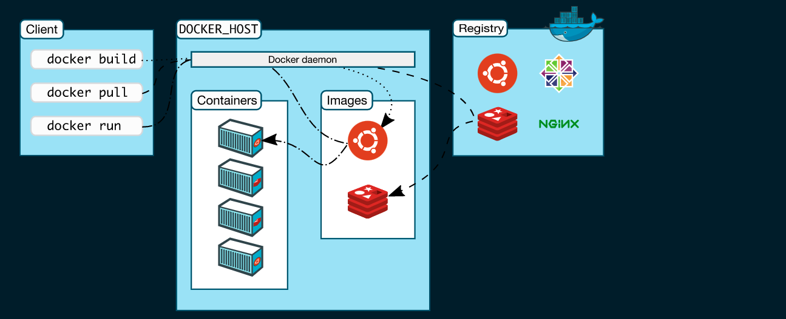

# docker_learn
Learning docker, a little deeper this time.

### Docker Daemon
docker daemon is at the center of everything and it exposes REST apis. this is what is used by docker clients ot pull images and stuff.
The `dockerd` demon listens for docker api requests and manages 

### Docker client

The docker client (`docker`) is the primary way that many Docker users interact with docker. __When a command such as `docker run` is run. the client sends these commands to `docker`, which carries out them out.__


This illustration from  [Docker docs](https://docs.docker.com/get-started/overview/) is really helpful



### Docker Desktop

The docker Desktoop is an easy to install docker setup platform, it comes out of the box with *docker daemon* (`dockerd`) and *Dcoker client* (`docker`), docker compose, Docker content tryst, kubernetes and Credential Helper.

## Docker Objects

When docker is used, we are creating and using images, containers, networks, columes, plugins and other objects.

### Images

An image is a **read-only template with instructions for creating a Docker container**. Often, an image is basedon another image, with some additional customization. For example, you may build an image which is based on the `ubuntu` image. but installs Apache web server and your application as well as the configuration details needed to make your application run.

You might create your own images or you might only use those created by others and published in a registry. To build you own image you create a Dockerfile with simple syntax for defining the steps needed to create the image and run it.

**Each instruction in a Dockerfile creates a layer in the images. When the dockerfile is changed and the image is rebuilt, only the layers which have changed are rebuilt.**

### Containers
**A container is a runnable instance of an image.** You can **create, start, stop, move or delete** a container using the docker API or cli. You can connect a container to one or more networks, attach storage to it, or even create a new image based on its current state.

Containers are relatively well isolated from other containers and its host machine.

A container is defined by its image as well as any configuration options you provide to it when you create or start it. When a container is removed any changes to its state that are not stored in persistent storage disapear.

### Example `docker run` command


```
docker run -i -t ubuntu /bin/bash
```

The following happens for the above command

- if the `ubuntu` image is not locally available, docker pulls it from the configured registry.
- Docker allocates a read-write filesystem to the container, as its final layer. This allows a running container to create or modify files and directories in its local filesystem.
- Docker creates a network interface to connect the container to the default network, since no networking options were provided. This includes **assingning an IP address to the container**.
- Docker starts the container and executes `/bin/bash`, Because the container is running interactively and attached to your terminal (due to the `-i` and `-t` flags).


